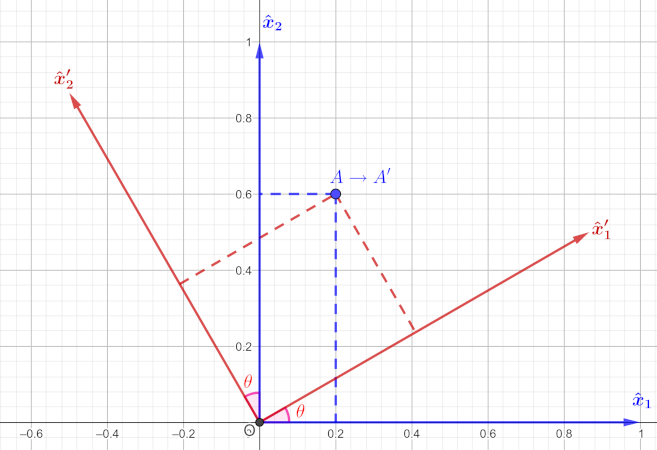
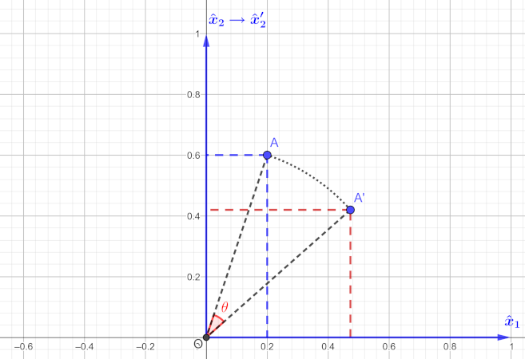

---
jupytext:
  formats: ipynb,md:myst
  text_representation:
    extension: .md
    format_name: myst
    format_version: 0.13
    jupytext_version: 1.11.5
kernelspec:
  display_name: Python 3 (ipykernel)
  language: python
  name: python3
---

# Stress - Strain Tensors & Elasticity

Dr. Emre S. Tasci, emre.tasci@hacettepe.edu.tr  
Dept. Eng. Physics  
Hacettepe University  
Ankara / Turkey

July 2024

```{code-cell} ipython3
import numpy as np
import sympy as smp
from scipy.optimize import fsolve
```

## Passive transformation

In the passive transformation, the point(s) stay fixed while the coordinate system rotates counterclockwise by an angle $\theta$:



+++

The relation between the old and new basis vectors are defined through the transformation matrix $P_\theta$:

$$P_\theta = \begin{pmatrix}\cos\theta&\sin\theta\\-\sin\theta&\cos\theta\end{pmatrix}$$

as

$$\begin{pmatrix}\hat x_1'\\\hat x_2'\end{pmatrix} = P_\theta\begin{pmatrix}\hat x_1\\\hat x_2\end{pmatrix}=
 \begin{pmatrix}\cos\theta&\sin\theta\\-\sin\theta&\cos\theta\end{pmatrix}\begin{pmatrix}\hat x_1\\\hat x_2\end{pmatrix}=\begin{pmatrix}\cos\theta\hat x_1 + \sin\theta \hat x_2\\-\sin\theta\hat x_1 + \cos\theta \hat x_2\end{pmatrix}$$
 
and the inverse transformation that relates the old basis to the new ones is of course given as:

$$\begin{pmatrix}\hat x_1\\\hat x_2\end{pmatrix} = P_\theta^{-1}\begin{pmatrix}\hat x_1'\\\hat x_2'\end{pmatrix}=
 \begin{pmatrix}\cos\theta&-\sin\theta\\\sin\theta&\cos\theta\end{pmatrix}\begin{pmatrix}\hat x_1'\\\hat x_2'\end{pmatrix}=\begin{pmatrix}\cos\theta\hat x_1' - \sin\theta \hat x_2'\\\sin\theta\hat x_1' + \cos\theta \hat x_2'\end{pmatrix}$$

```{code-cell} ipython3
theta = np.deg2rad(30)
cos = np.cos(theta)
sin = np.sin(theta)
P = np.array([[cos,sin],[-sin,cos]])
P
```

```{code-cell} ipython3
(x1,x2,x1p,x2p) = smp.symbols(["\hat{x}_{1}",
                               "\hat{x}_{2}",
                               "\hat{x}_{1}'",
                               "\hat{x}_{2}'"])
```

```{code-cell} ipython3
x = smp.Array([[x1],[x2]])
xp = smp.Array([[x1p],[x2p]])
theta = smp.symbols(r"\theta")
theta
```

```{code-cell} ipython3
P = smp.Array([[smp.cos(theta),smp.sin(theta)],
               [-smp.sin(theta),smp.cos(theta)]])
Pi = smp.Array([[smp.cos(theta),-smp.sin(theta)],
                [smp.sin(theta),smp.cos(theta)]])
P
```

Consider a point A, defined as:

$$A=\begin{pmatrix}3\\4\end{pmatrix}_{\hat x_1,\hat x_2} = 3\hat x_1 + 4 \hat x_2$$

From the above transformation, we see that:

$$\begin{matrix}\hat x_1 = \cos\theta \hat x_1'-\sin\theta \hat x_2'\\
\hat x_2 = \sin\theta \hat x_1'+\cos\theta \hat x_2'\end{matrix}$$

+++

Substitution of the new basis in place of the old ones, we have:

$$\begin{align}A &= 3\left( \cos\theta \hat x_1'-\sin\theta \hat x_2'\right)+4\left(\sin\theta \hat x_1'+\cos\theta \hat x_2'\right)\\
&=\left(3\cos\theta+4\sin\theta\right)\hat x_1' + \left(-3\sin\theta+4\cos\theta \right)\hat x_2'\\
&=\begin{pmatrix}3\cos\theta+4\sin\theta\\-3\sin\theta+4\cos\theta\end{pmatrix}_{\hat x_1',\hat x_2'}
\end{align}$$

```{code-cell} ipython3
Ap = smp.Array([[3*smp.cos(theta)+4*smp.sin(theta)],
                [-3*smp.sin(theta)+4*smp.cos(theta)]])
Ap
```

```{code-cell} ipython3
Ap_subs = Ap.subs(theta,np.pi/6)
Ap_subs
```

```{code-cell} ipython3
Ap_np = np.array(Ap_subs).astype(float)
Ap_np
```

$$A = 3\hat x_1 + 4 \hat x_2 = \left(3\cos\theta+4\sin\theta\right)\hat x_1' + \left(-3\sin\theta+4\cos\theta \right)\hat x_2'$$

or, in other words:

$$ A = \begin{pmatrix}3\\4\end{pmatrix}_{\hat x_1,\hat x_2} = \begin{pmatrix}3\cos\theta+4\sin\theta\\-3\sin\theta+4\cos\theta\end{pmatrix}_{\hat x_1',\hat x_2'}$$

+++

## Active Transformation



We could have perceived the same action by _rotating_ the point in question in the opposite direction towards the coordinate axis. In our example, this is equivalent to rotating the point 30<sup>o</sup> in the clockwise direction instead of rotating the coordinate system 30<sup>o</sup> along the counter-clockwise direction. 

Since the rotation operator $R_\theta$ is defined as:

$$R_\theta = \begin{pmatrix}\cos\theta &-\sin\theta\\\sin\theta & \cos\theta\end{pmatrix}$$

and our rotation direction is along the clockwise, i.e., the negative direction, we'll have:

$$R_\theta = \begin{pmatrix}\cos(-\theta) &-\sin(-\theta)\\\sin(-\theta) & \cos(-\theta)\end{pmatrix}
=\begin{pmatrix}\cos\theta &\sin\theta\\-\sin\theta & \cos\theta\end{pmatrix}$$

As $\cos(\theta)$ and $\sin(\theta)$ are even and odd functions, respectively.

```{code-cell} ipython3
R = np.array([[cos,sin],[-sin,cos]])
np.dot(R,np.array([[3],[4]]))
```

## Tensor Analysis

Tensors transform according to a very strict formula. In our case, we are dealing with vectors (i.e., tensors of 1st rank) and they transform via the following equation:

$$\hat x_i' = a_{ij}\hat x_j$$

here, Einstein notation is followed and $a_{ij}$ is the cosine of the angle between the new base $\hat x_i'$ and the old one $\hat x_j$ (as usual, counter-clockwise being the positive direction and clockwise being the negative direction).

Considering our transformation:


+++

let's calculate the new basis in terms of the old ones. Writing the above equation in full form:

$$\begin{align}
\hat x_1' &= a_{11}\hat x_1 + a_{12}\hat x_2\\
\hat x_2' &= a_{21}\hat x_1 + a_{22}\hat x_2
\end{align}$$

From the graph, we see that:

$$\begin{array}{}
a_{11} = \cos(\angle{\hat x_1' \hat x_1}) = \cos(-\theta)=\cos\theta\\
a_{12} = \cos(\angle{\hat x_1' \hat x_2}) = \cos(\frac{\pi}{2}-\theta) = \sin\theta\\
a_{21} = \cos(\angle{\hat x_2' \hat x_1}) = \cos(-(\frac{\pi}{2}+\theta)) = -\sin\theta\\
a_{22} = \cos(\angle{\hat x_2' \hat x_2}) = \cos(-\theta) = \cos\theta
\end{array}$$

```{warning}
Check that, the angle is always calculated starting from the new basis and going towards the old one - that's why, when we're moving in clockwise direction, the angle is taken to be negative.
```

It is also obvious but still worth to mention: in general $a_{ij}\ne a_{ji}$.

Also, a transformation doesn't necessarily need to correspond to a simple rotation of the basis like the one we are considering. We could have two different angles between the corresponding new and old basis.

+++

Substitution of the $a$ values into the equation above, we find:

$$\begin{align}
\hat x_1' &= a_{11}\hat x_1 + a_{12}\hat x_2 = \cos\theta\hat x_1 + \sin\theta\hat x_2\\
\hat x_2' &= a_{21}\hat x_1 + a_{22}\hat x_2 = -\sin\theta\hat x_1 + \cos\theta\hat x_2
\end{align}$$

or in other "words":

$$\begin{pmatrix}\hat x_1'\\\hat x_2'\end{pmatrix} = \begin{pmatrix}\cos\theta&\sin\theta\\
-\sin\theta&\cos\theta\end{pmatrix}\begin{pmatrix}\hat x_1\\\hat x_2\end{pmatrix}$$

as expected.

+++

### The transformation matrix

As we have seen, the transformation matrix $P$ composes of the cosines relating the new axes to the old ones:

$$P=\left[\begin{matrix}a_{11} & a_{12} & a_{13}\\a_{21} & a_{22} & a_{23}\\a_{31} & a_{32} & a_{33}\end{matrix}\right]$$

Vectors and tensors transform in accordance with the following transformation formulas:

$$v_{i}' = a_{ij} v_{j}\\
T_{ij}' = a_{ik}a_{jl}T_{kl}$$

\[Nye1985 I.2 "Transformations"\]

Here, the Einstein summation notation has been used, so, for example, $\vec v'$ and $T_{12}'$ are calculated as:

$$v'=\begin{bmatrix}x'\\y'\\z'\end{bmatrix}=\begin{bmatrix}a_{11} x + a_{12} y + a_{13} z\\a_{21} x + a_{22} y + a_{23} z\\a_{31} x + a_{32} y + a_{33} z\end{bmatrix}$$

$$\begin{align}T_{12}' &= a_{11}a_{21}T_{11}+a_{11}a_{22}T_{12}+a_{11}a_{23}T_{13}\\
&+a_{12}a_{21}T_{21}+a_{12}a_{22}T_{22}+a_{12}a_{23}T_{23}\\
&+a_{13}a_{21}T_{31}+a_{13}a_{22}T_{32}+a_{13}a_{23}T_{33}\end{align}$$

+++

## Principal stresses & axes

### Case

Calculate the principal stresses and their directions for the given stress tensor $\sigma$:

$$\sigma = \begin{bmatrix}
5&-7&3\\
-7&9&-4\\
3&-4&-6\end{bmatrix}$$

### Solution

Normally this is pretty straightforward as the eigenvalues yield the principal stresses and the eigenvectors their direction, so:

```{code-cell} ipython3
sigma = np.zeros((3,3),float)
sigma[0,1] = -7
sigma[0,2] = 3
sigma[1,2] = -4
sigma += sigma.T 
sigma += np.diag([5,9,-6])
sigma
```

```{code-cell} ipython3
[l,u] = np.linalg.eig(sigma)
l,u
```

Thus, the principal stresses $(\sigma_i)$ and their corresponding axes' directions $(\vec a_i)$ (wrt the "original" basis) are:

$$\boxed{\begin{align}\sigma_I &= 15.446&\leftrightarrow& &\vec a_I &= \begin{bmatrix}0.586\\-0.799\\-0.135\end{bmatrix}\\
\sigma_{II} &= -0.280&\leftrightarrow& &\vec a_{II} &= \begin{bmatrix}-0.778\\-0.602\\0.182\end{bmatrix}\\
\sigma_{III} &= -7.166&\leftrightarrow& &\vec a_{III} &= \begin{bmatrix}0.228\\0.002\\0.974\end{bmatrix}\end{align}}$$

```{caution}
Notice that even though the eigenvectors are the columns of the _u_ matrix, for the principal axes' directions we are reading by the rows. This is due the fact that $\sigma = u.\sigma'.u^{-1}$ whereas we are interested in the transformation that transforms $\sigma$ to $\sigma'$, which is given by the reciprocal equation: $\sigma' = u^{-1}.\sigma.u$. As $u$ is an orthogonal matrix, its inverse is just its transpose.
```

$\sigma'$ is the diagonalized form of $\sigma$, meaning that, when the axes are oriented as such, there is only pure stress along those directions.

```{code-cell} ipython3
sigma_p = np.diag(l)
sigma_p
```

So, basically, we have thus transformed our stress tensor into the diagonalized form via:

$$\sigma = u.\sigma'.u^{-1}$$

or in other words:

$$\sigma' = u^{-1}.\sigma.u$$

_(As $u$ is an orthogonal matrix, its inverse is equal to its transpose.)_

+++

### Tensor transformation

As the $\sigma$ tensor transforms according to:

$$\sigma_{ij}' = a_{ik}a_{jm}\sigma_{km}$$

and from the relations above, we see that $a = u^{-1} = u^T$.

We can confirm this:

```{code-cell} ipython3
sigma_p = np.zeros_like(sigma)
a = u.T
for i in range(3):
    for j in range(3):
        for k in range(3):
            for m in range(3):
                    sigma_p[i,j] += a[i,k]*a[j,m]*sigma[k,m]
print(sigma_p)
print()
# Setting the "almost-zero" values (due to numerical calculations)
# i.e., the off-diagonal elements, to zero, for clarity:
sigma_p[np.isclose(sigma_p,np.zeros((3,3)))] = 0
print(sigma_p)
```

We could have obtained our diagonalized stress tensor via the $\sigma' = u^{-1}.\sigma.u$ transformation equation as well:

```{code-cell} ipython3
sigma_p2 = np.linalg.multi_dot((u.T,sigma,u))
print(sigma_p2)

print()

sigma_p2[np.isclose(sigma_p2,np.zeros((3,3)))] = 0
print(sigma_p2)
```

### Further analysis

$\sigma$ being the stress tensor, the following invariants _(as the name suggests, duh!)_ must be the same in any coordinate system:

$$\begin{align}
I_1 &= \sigma_{11}+\sigma_{22}+\sigma_{33} = \sigma_{kk}\\
I_2 &= \sigma_{11}\sigma_{22}+\sigma_{11}\sigma_{33}
+\sigma_{22}\sigma_{33}-\sigma_{12}^2-\sigma_{23}^2-\sigma_{13}^2
=\frac{1}{2}\left(\sigma_{ii}\sigma_{jj}-\sigma_{ij}\sigma_{ij}\right)\\
I_3 &= \det\sigma=\frac{1}{3}\sigma_{ij}\sigma_{jk}\sigma_{ki}
\end{align}$$

and the principal stresses can be found as the roots of the characteristic equation:

$$f(\sigma_p) = \sigma_p^3-I_1\sigma_p^2+I_2\sigma_p-I_3$$

[\[Roylance2001\]](https://web.mit.edu/course/3/3.11/www/modules/trans.pdf)

```{code-cell} ipython3
def CalcInvariants(sigma):
    I1 = np.trace(sigma)
    I2 = sigma[0,0]*sigma[1,1]\
         + sigma[0,0]*sigma[2,2]\
         + sigma[1,1]*sigma[2,2]\
         - sigma[0,1]**2\
         - sigma[1,2]**2\
         - sigma[0,2]**2

    # Alternative calculation of I2
    # through the Einstein summation
    #I2_p1 = I2_p2 = 0
    #for i in range(3):
    #    for j in range(3):
    #        I2_p1 += sigma[i,i]*sigma[j,j]
    #        I2_p2 += sigma[i,j]**2
    #I2 = 0.5*(I2_p1 - I2_p2)
    
    I3 = np.linalg.det(sigma)
    return np.round((I1,I2,I3),3)
```

* Invariants from our original $\sigma$:

```{code-cell} ipython3
CalcInvariants(sigma)
```

* Invariants from our diagonalized $\sigma'$:

```{code-cell} ipython3
CalcInvariants(sigma_p)
```

Finding the roots of the characteristic equation once again yields the principal stresses.

```{code-cell} ipython3
(I1,I2,I3) = CalcInvariants(sigma)
np.roots([1,-I1,I2,-I3])
```

For the principal axes' directions _-if we ever forgot that they are derived from the eigenvectors of the $\sigma$-_ we can use the following equations (not surprisingly) derived from:

$$\begin{align}\sigma .\vec u_i &= \sigma_i. \sigma\\
\begin{bmatrix}\sigma_{11} & \sigma_{12} & \sigma_{13} \\
\sigma_{21} & \sigma_{22} & \sigma_{23} \\
\sigma_{31} & \sigma_{32} & \sigma_{33} \end{bmatrix} 
\underbrace{\begin{bmatrix}u_{1i}\\ u_{2i}\\ u_{3i}\end{bmatrix}}_{\vec u_i} &= \sigma_i \begin{bmatrix}u_{1i}\\ u_{2i}\\ u_{3i}\end{bmatrix}\end{align}$$

This translates to:

$$(\sigma - \sigma_i \mathbb{1}) = \mathbb{0}$$

and from here we can derive the first two following equations (with the third from derived from the normalization condition):

$$\begin{gather}(\sigma_{11}u_{1i}-\sigma_i)+\sigma_{12}u_{2i}+\sigma_{13}u_{3i} = 0\\
\sigma_{21}u_{1i}+(\sigma_{22}-\sigma_i)u_{2i}+\sigma_{23}u_{3i} = 0\\
u_{1i}^2 + u_{2i}^2 +u_{3i}^2 = 1
\end{gather}$$

[\[Lagace2008\]](https://web.mit.edu/16.unified/www/FALL/materials/Lectures/M2.4-Unified08.pdf)

Implemented code follows (we're using [`fsolve`](https://docs.scipy.org/doc/scipy/reference/generated/scipy.optimize.fsolve.html) to solve the non-linear equations set):

```{code-cell} ipython3
def eqns(p,S_i):
    (u_i1,u_i2,u_i3) = p
    eqn1 = (sigma[0,0]-S_i)*u_i1 + sigma[0,1]*u_i2 + sigma[0,2]*u_i3
    eqn2 = sigma[0,1]*u_i1 + (sigma[1,1]-S_i)*u_i2 + sigma[1,2]*u_i3
    eqn3 = u_i1**2 + u_i2**2 + u_i3**2 - 1
    #eqn4 = sigma[0,2]*u_i1 + sigma[1,2]*u_i2 + (sigma[2,2] - S_i)*u_i3
    return (eqn1,eqn2,eqn3)
```

```{code-cell} ipython3
# we already have the principle stresses
# (either from the eigenvalues or 
# from the roots of the characteristics equation)

print("Principle Stresses:")
print(l)

print("-="*20)

print("Principle Axes (read in columns):")
for SS_i in l:
    psol = fsolve(eqns,(1,2,3),args=SS_i)
    print(psol)
```

```{note}
In the above output, the $u_i$ are presented in rows, hence, by printing them line after line, the $a_i$ directions present themselves in columns ;)
```

+++

## References
* **Lagace2008**: Paul A. Lagace, "Stress and Strain Transformations", [Materials and Structures Course](https://web.mit.edu/16.unified/www/FALL/materials/index.html) (2.4) MIT OCW [link](https://web.mit.edu/16.unified/www/FALL/materials/Lectures/M2.4-Unified08.pdf)
* **Nye1985**: Nye, John Frederick. _Physical properties of crystals: their representation by tensors and matrices._ Oxford university press, 1985.
* **Roylance2001**: David Roylance, "Transformation of Stresses and Strains", [Mechanics of Materials Course](https://ocw.mit.edu/courses/3-11-mechanics-of-materials-fall-1999/pages/modules/) (3.11) MIT OCW [link](https://web.mit.edu/course/3/3.11/www/modules/trans.pdf)
